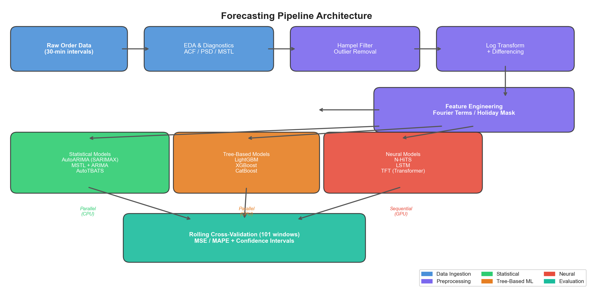
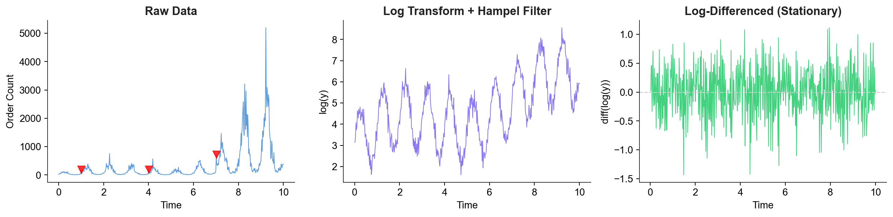
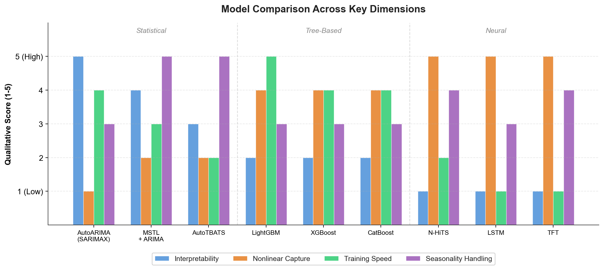
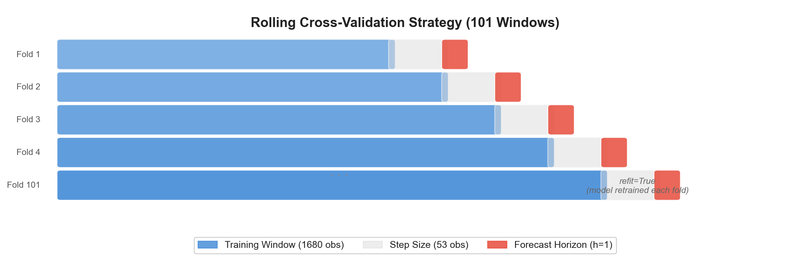

# Anomaly Detection in E-Commerce Order Pipelines

Forecasting order import volumes at 30-minute granularity using a 9-model ensemble comparison across statistical, tree-based, and neural architectures -- built for a Microsoft-scale anomaly detection system.

The core idea: if you can accurately forecast what "normal" order volume looks like, then anything that deviates from that forecast is an anomaly worth investigating. This project is the forecasting backbone of that approach.

<p align="center">
  
</p>

## Summary

- **Domain**: E-commerce order pipeline monitoring (Order Import -> Fraud Check -> Authorized Order -> Pick Ticket)
- **Data**: Half-hourly order volume time series with strong daily (period=48) and weekly (period=336) seasonality, plus Black Friday holiday spikes
- **Preprocessing**: Hampel filter outlier removal, log transformation, first-order differencing, Fourier exogenous features, hand-crafted holiday mask
- **Models**: 9 forecasting models across 3 families -- statistical (AutoARIMA, MSTL+ARIMA, AutoTBATS), gradient-boosted trees (LightGBM, XGBoost, CatBoost), and deep learning (N-HiTS, LSTM, Temporal Fusion Transformer)
- **Evaluation**: Rolling cross-validation with 101 windows, 1680-observation training window, step size of 53, horizon $h=1$
- **Execution**: GPU-bound neural models run sequentially; CPU-bound statistical and tree models run in parallel via `multiprocessing.Process`

## How to use

### Exploratory analysis

The full EDA pipeline lives in `explore_order_import.ipynb`. It covers:

1. Data loading and interpolation of missing 30-min intervals
2. Rolling statistics (mean, median, std, IQR) at daily/weekly/monthly windows
3. Distribution analysis with histograms, KDE, and bucketed boxplots
4. ACF/PACF analysis to identify significant lags
5. Periodogram and Welch PSD for frequency-domain seasonality detection
6. MSTL decomposition (trend + seasonal + residual)
7. Hampel filter outlier detection and removal ($5\sigma$, window=50)
8. Feature engineering: log transform, differencing, Fourier terms, holiday mask
9. Train/test export to `dataset/cleaned/`

Place your raw data at `./dataset/order_imported.csv` with columns `ds` (datetime) and `y` (order count), then run the notebook end to end.

### Baseline forecasting

```bash
python oi_baseline.py
```

This runs all 9 models with rolling cross-validation and writes results to `./baseline/cv_<model>.csv`. Neural models (N-HiTS, LSTM, TFT) run first on GPU, then statistical and tree models run in parallel on CPU.

Key parameters in `oi_baseline.py`:

```
WINDOW_SIZE = 1680        # training window (35 days at 30-min intervals)
h = 1                     # single-step forecast
step_size = 53            # ~26.5 hours between CV folds
n_windows = 101           # number of CV folds
level = [50, 80, 95]      # confidence interval levels
```

### Evaluation

```bash
python eval.py
```

Reads CV outputs, reverses the log-differencing transform to get predictions back to original scale, computes MSE and MAPE, and saves forecast-vs-actual plots to `./baseline/forecasts/`.

The `transforms` dict in `eval.py` controls which models get evaluated. Uncomment entries to enable them:

```python
transforms = {
    'sarimax': (_retrend, 'AutoARIMA', [50, 80, 95]),
    # 'mstla' : (_unlog, 'MSTL', [50, 80, 95]),
    # 'lightgbm' : (_unlog, 'LGBMRegressor', []),
    # ...
}
```

## Preprocessing

The raw order data has strong non-stationarity: an upward trend, multiplicative daily/weekly seasonality, and occasional holiday spikes that are 3-4x the normal volume. The series also has sporadic outlier spikes from system glitches that have nothing to do with actual order patterns.

<p align="center">
  
</p>

The preprocessing pipeline handles this in stages:

1. **Outlier removal** -- Hampel filter with $5\sigma$ threshold and window of 50 observations. Detected outliers get NaN'd and linearly interpolated. This is conservative enough to preserve Black Friday spikes while removing system artifacts.

2. **Log transform** -- $y_{\text{log}} = \ln(y)$ stabilizes the variance and turns multiplicative seasonality into additive, which is what most models assume.

3. **Differencing** -- $y_{\text{detrended}} = \Delta y_{\text{log}} = y_{\text{log},t} - y_{\text{log},t-1}$ removes the trend component and produces a roughly stationary series.

4. **Fourier exogenous features** -- Sine/cosine pairs at periods 48 (daily) and 336 (weekly) with order 2 each, giving 8 additional features for models that accept exogenous regressors. These encode the known seasonal structure without requiring the model to discover it.

5. **Holiday mask** -- Binary feature flagging Black Friday weekend (4th Thursday of November 5:30 AM through the following Monday 11:30 PM). This was hand-crafted because the spikes are dramatic enough to distort model fits if left unaccounted for.

Different models receive different transforms based on their architecture:

| Model Family | Target Variable | Exogenous Features |
|---|---|---|
| MSTL + ARIMA | `y_log` | Holiday mask |
| AutoARIMA (SARIMAX) | `y_detrended` | Holiday mask, Fourier terms |
| AutoTBATS | Raw `y` | None (handles seasonality internally) |
| LightGBM / XGBoost / CatBoost | `y_log` | Holiday mask, Fourier (48, 336), lags [1, 2, 48, 336] |
| N-HiTS / LSTM / TFT | `y_detrended` | Holiday mask, `y_log`, Fourier (48, 336) |

## Models

### Statistical (CPU, parallelized)

- **AutoARIMA (SARIMAX)** -- Automatic ARIMA order selection with seasonal period 48, differencing forced to $d=0$ (already differenced), and approximation enabled for speed. Fed the Fourier-augmented detrended series.
- **MSTL + ARIMA** -- Multiple Seasonal-Trend decomposition using LOESS with dual seasonality (48, 336), with AutoARIMA as the trend forecaster. This decomposes the series into trend, daily seasonal, weekly seasonal, and residual, then forecasts each component.
- **AutoTBATS** -- Trigonometric seasonality, Box-Cox transformation, ARMA errors, Trend, and Seasonal components. Gets the raw series and handles its own transformations with dual seasonality [48, 336].

### Tree-Based ML (CPU, parallelized)

- **LightGBM** -- 100 estimators, lag features at [1, 2, 48, 336], Fourier exogenous features. Fast and handles the tabular lag structure well.
- **XGBoost** -- Same lag/feature setup as LightGBM, learning rate 0.1. Included for comparison against LightGBM on the same feature set.
- **CatBoost** -- Native categorical feature support for the holiday mask. Same architecture as the other boosters but with CatBoost's ordered boosting and symmetric trees.

### Neural (GPU, sequential)

- **N-HiTS** -- Neural Hierarchical Interpolation for Time Series. Multi-rate signal decomposition with downsampling factors [24, 12, 1], capturing patterns at different temporal scales. Input size 336 (1 week), MQLoss with 7 quantiles, 2000 max steps with early stopping.
- **LSTM** -- Long Short-Term Memory network. Same input/loss configuration as N-HiTS. Included as a recurrent baseline against the more modern architectures.
- **Temporal Fusion Transformer (TFT)** -- Attention-based architecture with variable selection, `hidden_size=16`, `n_head=2`, standard scaling. The smallest model that still gets the attention mechanism's interpretability benefits.

<p align="center">
  
</p>

## Cross-Validation Strategy

Rather than a simple train/test split, every model is evaluated using **rolling origin cross-validation** with 101 windows. This simulates how the model would actually perform in production, where you retrain periodically and forecast the next observation.

<p align="center">
  
</p>

- **Training window**: 1680 observations (35 days at 30-min frequency)
- **Step size**: 53 observations (~26.5 hours) between folds
- **Horizon**: $h=1$ (single next-step forecast)
- **Refit**: `True` -- model is completely retrained at each fold
- **Total folds**: 101, covering ~111 days of test data

This is computationally expensive -- especially for the neural models -- but it gives a much more honest picture of forecast quality than holdout evaluation. The `refit=True` flag means each fold gets a freshly trained model, not just a sliding prediction window.

## Process

1. I started by exploring the raw order data in the notebook. The series had obvious daily and weekly cycles, confirmed by ACF showing significant lags at 48 and 336 and Welch PSD showing spectral peaks at those frequencies. The data was also clearly non-stationary with an upward trend and heteroscedastic variance.

2. The first thing I tried was running ARIMA on the raw series. This was a mistake -- the series has **dual seasonality** (daily and weekly), and ARIMA's single seasonal component can't capture both. MSTL was the right decomposition approach here because it separates each seasonal component before forecasting.

3. Outlier handling was tricky. I needed to remove system glitches without clipping the Black Friday spikes, which are real signal. The Hampel filter at $5\sigma$ hit the right balance -- aggressive enough for the random spikes, conservative enough to preserve the holiday behavior. I verified this by checking that the holiday observations survived the filter.

4. The log-differencing pipeline was chosen over simple scaling because the variance scales with the level (multiplicative seasonality). After log + diff, the ACF residuals looked much cleaner, confirming stationarity.

5. For the tree-based models, I added explicit lag features at [1, 2, 48, 336] because gradient boosted trees can't learn temporal dependencies on their own -- they need the history handed to them as features. The Fourier terms serve a similar purpose, encoding the seasonal pattern without requiring hundreds of lag features.

6. I separated GPU and CPU workloads deliberately. The neural models (N-HiTS, LSTM, TFT) can't share the GPU effectively, so they run sequentially. The statistical and tree models are CPU-bound and run in parallel using Python's `multiprocessing.Process`, which avoids the GIL entirely.

7. The TFT was the most finicky model to configure. I kept `hidden_size=16` and `n_head=2` because anything larger overfit quickly on this relatively small dataset. The `batch_size=16` in its cross-validation call was also necessary to avoid memory issues during the 101-fold evaluation.

## Final Notes

- **This is the forecasting baseline, not the anomaly detector itself.** The anomaly detection layer would sit on top of these forecasts, flagging observations that fall outside the prediction intervals. That part is straightforward once you have reliable forecasts -- the hard part is getting the forecasts right.

- **The evaluation pipeline needs generalization.** Right now `eval.py` has model-specific inverse transform logic (log vs. log-diff) wired through a dict. If I were extending this to more models or different datasets, I'd refactor the transform chain into a composable pipeline.

- **I didn't tune the neural models aggressively.** The N-HiTS, LSTM, and TFT all use relatively conservative hyperparameters (learning rate $10^{-4}$, early stopping after 2-3 patience steps). There's probably 5-15% MAPE improvement available from proper hyperparameter search, but the 101-fold CV already takes hours per model.

- **The holiday feature is brittle.** It only covers Black Friday weekend. A production system would need a proper holiday calendar (Christmas, Memorial Day, Prime Day, etc.) and ideally a continuous "holiday intensity" feature rather than a binary mask.

- **Window size of 1680 was chosen empirically.** 35 days captures at least 5 full weekly cycles, which gives MSTL and the weekly Fourier terms enough data to estimate the weekly pattern reliably. Shorter windows degraded MSTL decomposition quality.
